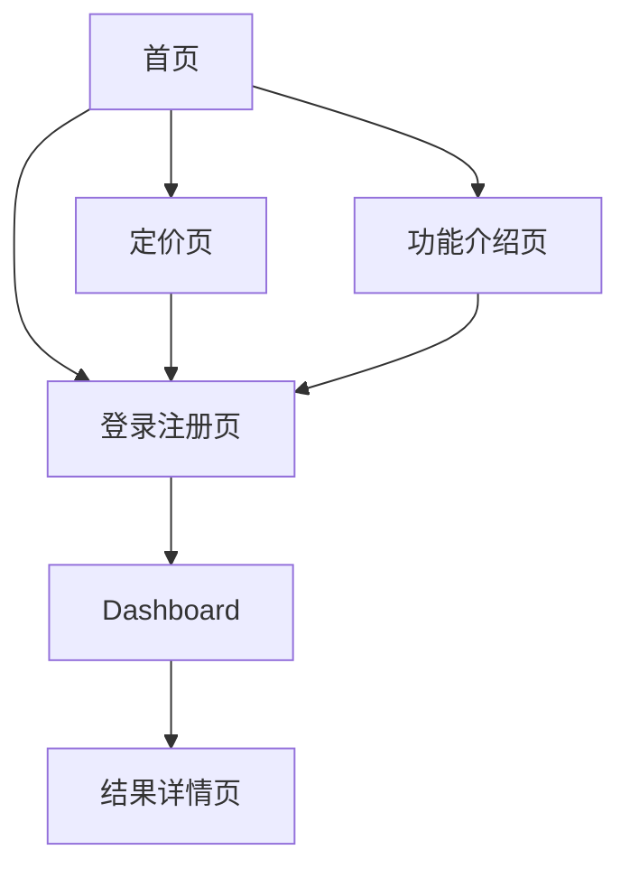

# Ankigenix 产品需求文档

## 1. 产品概述

Ankigenix 是一个AI驱动的科学闪卡生成器，旨在为学习者提供最高质量的Anki卡片生成服务。产品通过先进的AI技术，支持多种内容输入方式，自动生成高质量的学习闪卡，显著提升学习效率。

产品采用免费+订阅的商业模式，为不同需求的用户提供差异化服务，目标是成为全球领先的AI学习工具平台。

## 2. 核心功能

### 2.1 用户角色

| 角色 | 注册方式 | 核心权限 |
|------|----------|----------|
| 免费用户 | 邮箱注册 | 基础闪卡生成、有限额度、基础卡片类型 |
| Pro用户 | 订阅升级($5/月) | 无限额度、高级功能(Cloze、概念拆分、主题生成)、优先处理 |

### 2.2 功能模块

我们的Ankigenix需求包含以下主要页面：

1. **首页**：Hero展示区、功能特性介绍、定价展示、使用说明
2. **Dashboard**：顶部信息栏、核心操作区、生成结果列表、交付功能
3. **登录注册页**：用户认证、账户管理
4. **定价页**：订阅方案详情、支付流程
5. **功能介绍页**：AI特性详细说明、使用案例

### 2.3 页面详情

| 页面名称 | 模块名称 | 功能描述 |
|----------|----------|----------|
| 首页 | 公共头部导航栏 | Logo导航、菜单链接(首页/功能/定价)、多语言切换(CN/EN/JP)、登录注册入口、主题切换 |
| 首页 | Hero展示区 | 主标题"Ankigenix：AI驱动的科学闪卡生成器"、副标题介绍、"免费开始"CTA按钮 |
| 首页 | 功能特性区 | 展示核心优势：视频生成、智能Cloze、复杂概念拆分、AI质量评分，突出Pro标记 |
| 首页 | 定价CTA区 | Pro订阅价值展示($5/月)、引导跳转定价页 |
| 首页 | 使用说明区 | 工作流介绍：粘贴→生成→导出Anki |
| Dashboard | 顶部信息栏 | 额度显示(剩余字数/Pro无限制)、异步任务状态提醒 |
| Dashboard | 核心操作区 | Tab切换输入模式：文本/文件、URL/视频、主题生成[Pro]；AI配置：卡片类型、难度、语言、卡组命名；"一键生成闪卡"按钮 |
| Dashboard | 生成结果列表 | 历史任务列表：任务名称、状态(完成/处理中/失败)、创建时间 |
| Dashboard | 结果详情视图 | 卡片预览列表、质量评分显示、编辑功能、"导出.apkg"按钮 |
| 登录注册页 | 用户认证 | 邮箱登录注册、密码重置、第三方登录选项 |
| 定价页 | 订阅方案 | 免费vs Pro功能对比、价格展示、支付流程 |
| 功能介绍页 | AI特性说明 | 详细介绍各项AI功能、使用案例、效果展示 |

## 3. 核心流程

### 未登录用户流程
用户访问首页 → 浏览功能特性 → 查看定价信息 → 注册账户 → 进入Dashboard开始使用

### 已登录用户流程
用户登录 → 自动跳转Dashboard → 选择输入方式 → 配置AI参数 → 生成闪卡 → 预览编辑 → 导出使用

### 页面导航流程图

## 4. 用户界面设计

### 4.1 设计风格

- **主色调**：深灰/黑色背景(#0a0a0a)，纯白/浅灰文本(#ededed)
- **强调色**：亮蓝(#3b82f6)用于主要操作，亮绿(#10b981)用于成功状态
- **按钮样式**：圆角设计，悬停效果，渐变背景
- **字体**：Geist Sans主字体，Geist Mono代码字体，16px基础字号
- **布局风格**：卡片式设计，顶部导航，网格布局，充足留白
- **图标风格**：简洁线性图标，统一风格，适当动效

### 4.2 页面设计概览

| 页面名称 | 模块名称 | UI元素 |
|----------|----------|--------|
| 首页 | Hero区域 | 大标题(48px粗体)、副标题(18px常规)、渐变CTA按钮(蓝色到绿色)、背景几何图案 |
| 首页 | 功能特性区 | 4列网格布局、图标+标题+描述、Pro徽章(金色)、悬停放大效果 |
| 首页 | 定价区域 | 卡片式对比、价格突出显示、功能列表、立即订阅按钮 |
| Dashboard | 顶部信息栏 | 进度条显示额度、状态指示器、通知图标、用户头像 |
| Dashboard | 操作区 | Tab切换器、大文本框、拖拽区域、配置面板、主要操作按钮 |
| Dashboard | 结果列表 | 表格布局、状态标签、时间戳、操作按钮组 |
| 公共导航 | 头部导航 | Logo(左)、导航菜单(中)、工具栏(右)、分隔线、阴影效果 |

### 4.3 响应式设计

产品采用移动优先的响应式设计策略：
- **桌面端(1024px+)**：完整功能展示，多列布局，悬停交互
- **平板端(768-1023px)**：适配触摸操作，调整布局密度
- **移动端(320-767px)**：单列布局，大按钮设计，手势友好
- **触摸优化**：按钮最小44px，间距充足，滑动操作支持