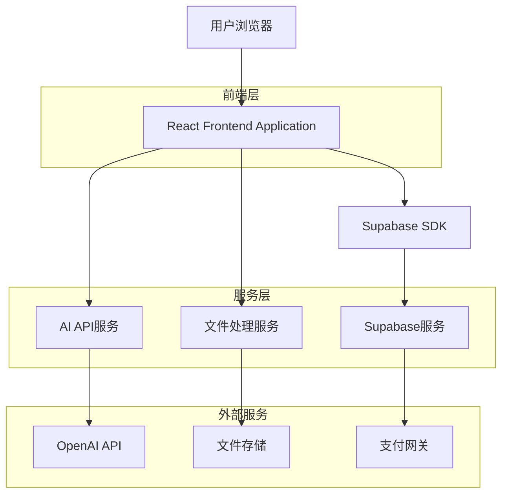
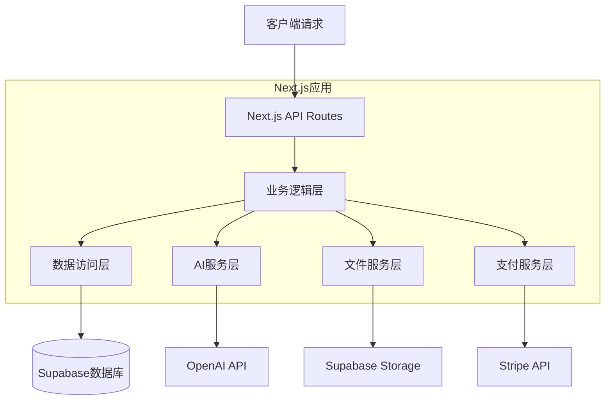
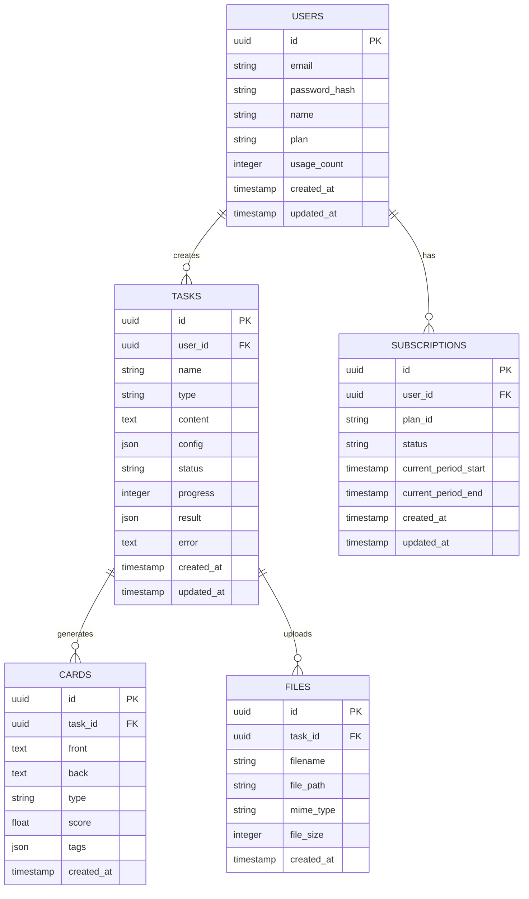

# Ankigenix 技术架构文档

## 1. 架构设计



## 2. 技术描述

* **前端**: React\@19 + Next.js\@15 + TypeScript\@5 + Tailwind CSS\@4 + Vite

* **后端**: Supabase (认证、数据库、存储)

* **AI服务**: OpenAI API集成

* **状态管理**: React Context + useState/useReducer

* **文件处理**: 客户端上传 + Supabase Storage

* **支付**: Stripe集成

## 3. 路由定义

| 路由                  | 用途             |
| ------------------- | -------------- |
| /                   | 首页，展示产品介绍和营销内容 |
| /features           | 功能介绍页，详细说明AI特性 |
| /pricing            | 定价页，展示订阅方案和支付  |
| /login              | 登录页，用户认证入口     |
| /register           | 注册页，新用户注册      |
| /dashboard          | 仪表板，已登录用户的主工作台 |
| /dashboard/history  | 历史记录页，查看所有生成任务 |
| /dashboard/settings | 设置页，用户偏好和账户管理  |
| /help               | 帮助中心，使用说明和FAQ  |

## 4. API定义

### 4.1 核心API

**用户认证相关**

```
POST /api/auth/login
```

请求参数:

| 参数名      | 参数类型   | 是否必需 | 描述   |
| -------- | ------ | ---- | ---- |
| email    | string | true | 用户邮箱 |
| password | string | true | 用户密码 |

响应参数:

| 参数名     | 参数类型    | 描述     |
| ------- | ------- | ------ |
| success | boolean | 登录是否成功 |
| user    | object  | 用户信息   |
| token   | string  | 认证令牌   |

**闪卡生成相关**

```
POST /api/cards/generate
```

请求参数:

| 参数名        | 参数类型   | 是否必需  | 描述                        |
| ---------- | ------ | ----- | ------------------------- |
| content    | string | true  | 输入内容                      |
| type       | string | true  | 输入类型(text/file/url/topic) |
| cardType   | string | true  | 卡片类型(qa/cloze/split)      |
| difficulty | number | false | 难度等级(1-5)                 |
| language   | string | false | 输出语言                      |
| deckName   | string | false | 卡组名称                      |

响应参数:

| 参数名           | 参数类型   | 描述        |
| ------------- | ------ | --------- |
| taskId        | string | 任务ID      |
| status        | string | 任务状态      |
| estimatedTime | number | 预计完成时间(秒) |

**任务状态查询**

```
GET /api/tasks/{taskId}
```

响应参数:

| 参数名      | 参数类型   | 描述                                      |
| -------- | ------ | --------------------------------------- |
| id       | string | 任务ID                                    |
| status   | string | 状态(pending/processing/completed/failed) |
| progress | number | 进度百分比                                   |
| result   | object | 生成结果(完成时)                               |
| error    | string | 错误信息(失败时)                               |

**卡片导出**

```
GET /api/cards/export/{taskId}
```

响应: .apkg文件下载

### 4.2 TypeScript类型定义

```typescript
// 用户类型
interface User {
  id: string;
  email: string;
  name: string;
  plan: 'free' | 'pro';
  usageCount: number;
  createdAt: string;
  updatedAt: string;
}

// 任务类型
interface Task {
  id: string;
  userId: string;
  name: string;
  type: 'text' | 'file' | 'url' | 'topic';
  content: string;
  config: TaskConfig;
  status: 'pending' | 'processing' | 'completed' | 'failed';
  progress: number;
  result?: CardResult[];
  error?: string;
  createdAt: string;
  updatedAt: string;
}

// 任务配置
interface TaskConfig {
  cardType: 'qa' | 'cloze' | 'split';
  difficulty: number;
  language: string;
  deckName: string;
}

// 卡片结果
interface CardResult {
  id: string;
  front: string;
  back: string;
  type: string;
  score: number;
  tags: string[];
}
```

## 5. 服务器架构图



## 6. 数据模型

### 6.1 数据模型定义



### 6.2 数据定义语言

**用户表 (users)**

```sql
-- 创建用户表
CREATE TABLE users (
    id UUID PRIMARY KEY DEFAULT gen_random_uuid(),
    email VARCHAR(255) UNIQUE NOT NULL,
    password_hash VARCHAR(255) NOT NULL,
    name VARCHAR(100) NOT NULL,
    plan VARCHAR(20) DEFAULT 'free' CHECK (plan IN ('free', 'pro')),
    usage_count INTEGER DEFAULT 0,
    created_at TIMESTAMP WITH TIME ZONE DEFAULT NOW(),
    updated_at TIMESTAMP WITH TIME ZONE DEFAULT NOW()
);

-- 创建索引
CREATE INDEX idx_users_email ON users(email);
CREATE INDEX idx_users_plan ON users(plan);

-- 权限设置
GRANT SELECT ON users TO anon;
GRANT ALL PRIVILEGES ON users TO authenticated;
```

**任务表 (tasks)**

```sql
-- 创建任务表
CREATE TABLE tasks (
    id UUID PRIMARY KEY DEFAULT gen_random_uuid(),
    user_id UUID NOT NULL REFERENCES users(id) ON DELETE CASCADE,
    name VARCHAR(255) NOT NULL,
    type VARCHAR(20) NOT NULL CHECK (type IN ('text', 'file', 'url', 'topic')),
    content TEXT,
    config JSONB NOT NULL DEFAULT '{}',
    status VARCHAR(20) DEFAULT 'pending' CHECK (status IN ('pending', 'processing', 'completed', 'failed')),
    progress INTEGER DEFAULT 0 CHECK (progress >= 0 AND progress <= 100),
    result JSONB,
    error TEXT,
    created_at TIMESTAMP WITH TIME ZONE DEFAULT NOW(),
    updated_at TIMESTAMP WITH TIME ZONE DEFAULT NOW()
);

-- 创建索引
CREATE INDEX idx_tasks_user_id ON tasks(user_id);
CREATE INDEX idx_tasks_status ON tasks(status);
CREATE INDEX idx_tasks_created_at ON tasks(created_at DESC);

-- 权限设置
GRANT SELECT ON tasks TO anon;
GRANT ALL PRIVILEGES ON tasks TO authenticated;
```

**卡片表 (cards)**

```sql
-- 创建卡片表
CREATE TABLE cards (
    id UUID PRIMARY KEY DEFAULT gen_random_uuid(),
    task_id UUID NOT NULL REFERENCES tasks(id) ON DELETE CASCADE,
    front TEXT NOT NULL,
    back TEXT NOT NULL,
    type VARCHAR(20) NOT NULL,
    score FLOAT DEFAULT 0 CHECK (score >= 0 AND score <= 1),
    tags JSONB DEFAULT '[]',
    created_at TIMESTAMP WITH TIME ZONE DEFAULT NOW()
);

-- 创建索引
CREATE INDEX idx_cards_task_id ON cards(task_id);
CREATE INDEX idx_cards_score ON cards(score DESC);

-- 权限设置
GRANT SELECT ON cards TO anon;
GRANT ALL PRIVILEGES ON cards TO authenticated;
```

**订阅表 (subscriptions)**

```sql
-- 创建订阅表
CREATE TABLE subscriptions (
    id UUID PRIMARY KEY DEFAULT gen_random_uuid(),
    user_id UUID NOT NULL REFERENCES users(id) ON DELETE CASCADE,
    plan_id VARCHAR(50) NOT NULL,
    status VARCHAR(20) NOT NULL CHECK (status IN ('active', 'canceled', 'past_due')),
    current_period_start TIMESTAMP WITH TIME ZONE NOT NULL,
    current_period_end TIMESTAMP WITH TIME ZONE NOT NULL,
    created_at TIMESTAMP WITH TIME ZONE DEFAULT NOW(),
    updated_at TIMESTAMP WITH TIME ZONE DEFAULT NOW()
);

-- 创建索引
CREATE INDEX idx_subscriptions_user_id ON subscriptions(user_id);
CREATE INDEX idx_subscriptions_status ON subscriptions(status);

-- 权限设置
GRANT SELECT ON subscriptions TO anon;
GRANT ALL PRIVILEGES ON subscriptions TO authenticated;
```

**初始化数据**

```sql
-- 插入示例用户
INSERT INTO users (email, password_hash, name, plan) VALUES
('demo@ankigenix.com', '$2b$10$example_hash', 'Demo User', 'free'),
('pro@ankigenix.com', '$2b$10$example_hash', 'Pro User', 'pro');

-- 插入示例任务
INSERT INTO tasks (user_id, name, type, content, config, status) VALUES
((SELECT id FROM users WHERE email = 'demo@ankigenix.com'), 
 '示例任务', 'text', '这是一个示例文本内容', 
 '{"cardType": "qa", "difficulty": 3, "language": "zh"}', 'completed');
```

